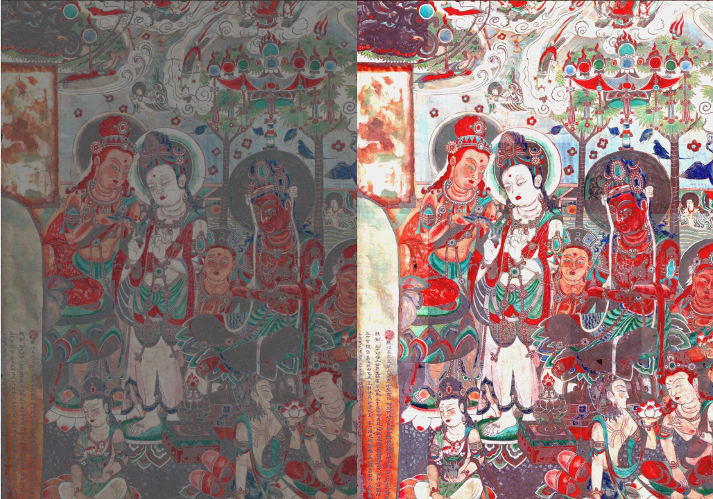
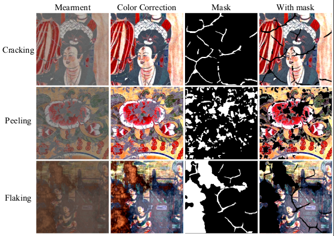
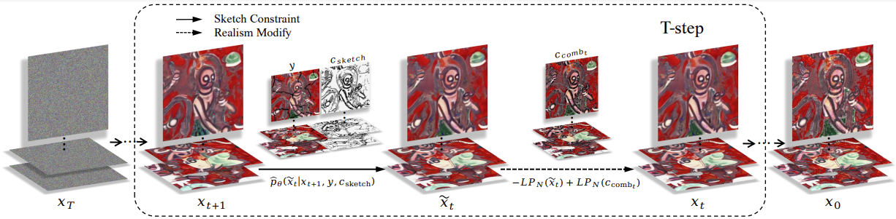

# MuralDDRM: A Novel Ancient Murals Restoration Framework with Sketch Constrain and Realism Modify.

[Dong Sui]<sup>1</sup>, [Nanting Song]<sup>1</sup>, [Yacong Li]<sup>2</sup>,  [Zhaoxin Li]<sup>3</sup>, [Yang Li]<sup>1</sup>,Maozu,Guo<sup>1</sup>,.<br />
<sup>1</sup>  Beijing University of Civil Engineering and Architecture, Beijing 102616, China.
<sup>2</sup>  Beijing Academic of Artificial Intelligence, Beijing 1022, China.
<sup>3</sup>  Chinese Academy of Agricultural Sciences, Beijing, 100081, China.

MuralDDRM uses pre-trained [DDPMs](https://hojonathanho.github.io/diffusion/) for solving the intricate and varied degradation issues in murals. It does so efficiently and without problem-specific supervised training.



## Running the Experiments
The code has been tested on PyTorch 1.8 and PyTorch 1.10. Please refer to `environment.yml` for a list of conda/mamba environments that can be used to run the code. 

### Pretrained models
We use pretrained models from [https://github.com/openai/guided-diffusion](https://github.com/openai/guided-diffusion), [https://github.com/pesser/pytorch_diffusion](https://github.com/pesser/pytorch_diffusion) and [https://github.com/ermongroup/SDEdit](https://github.com/ermongroup/SDEdit)

We used the mural dataset proposed by 

https://ieeexplore.ieee.org/document/10377893

, which contained a total of 170 large hand-restored or intact murals. Each large mural was randomly cropped into multiple patches, resulting in a total of 4,411 patches that were all 512 × 512 pixels in size. Among them, 3528 patches are used for pre-trained diffusion models without finetuning, 883 patches used as the testing set. The list of images is taken from [https://github.com/Shaocr/Building-Bridge-Across-the-Time-Disruption-and-Restoration-of-Murals-In-the-Wild/blob/main](https://github.com/Shaocr/Building-Bridge-Across-the-Time-Disruption-and-Restoration-of-Murals-In-the-Wild/blob/main)

The models and datasets are placed in the `exp/` folder as follows:
```bash
<exp> # a folder named by the argument `--exp` given to main.py
├── datasets # all dataset files
│   ├── murals # all Ancient murals files
│   ├── sketch # all Sketches files
├── logs # contains checkpoints and samples produced during training
│   ├── diffusion_models_checkpoints
│   │   └── ema_diffusion_lsun_<category>_model
│   │       └── model-x.ckpt # the checkpoint file saved at the x-th training iteration
│   ├── imagenet # Murals checkpoint files
│   │   ├── 512x512_diffusion_uncond.pt
├── image_samples # contains generated samples
├── txt # list of the 2k images used in dataset
│   ├── murals_test_2k.txt
└   ├── murals_test_1.txt
```

### Pre-processing

It is imperative to perform [color correction](https://github.com/puzzlesong8277/ColorCorrection)and [degradation detection](https://github.com/ultralytics/ultralytics) on the measurement as a pre-processing step, thereby laying a robust foundation for subsequent, detailed restoration efforts.



### Murals Restoration



The command to sample from the model is as follows:
```
python main.py --ni --config {CONFIG}.yml --doc {DATASET} --timesteps {STEPS} --eta {ETA} --etaB {ETA_B} --deg {DEGRADATION} --sigma_0 {SIGMA_0} -i {IMAGE_FOLDER}
```
where the following are options
- `ETA` is the eta hyperparameter in the paper. (default: `0.85`)
- `ETA_B` is the eta_b hyperparameter in the paper. (default: `1`)
- `STEPS` controls how many timesteps used in the process.
- `DEGREDATION` is the type of degredation allowed. (inp_mural)
- `SIGMA_0` is the noise observed in y.
- `CONFIG` is the name of the config file (see `configs/` for a list), including hyperparameters such as batch size and network architectures.
- `DATASET` is the name of the dataset used, to determine where the checkpoint file is found.
- `IMAGE_FOLDER` is the name of the folder the resulting images will be placed in (default: `images`)

For example, using 20 steps to repair cracking degradations murals:
```
python main.py --ni --config mural_512.yml --doc mural --timesteps 20 --eta 0.85 --etaB 1 --deg inp_mural --sigma_0 0.00
```
The generated images are place in the `<exp>/image_samples/{IMAGE_FOLDER}` folder, where `degradation`, `restoration`, `y0_mask` and `y_color_correction` .

The config files contain a setting controlling whether to test on samples from the trained dataset's distribution or not.

